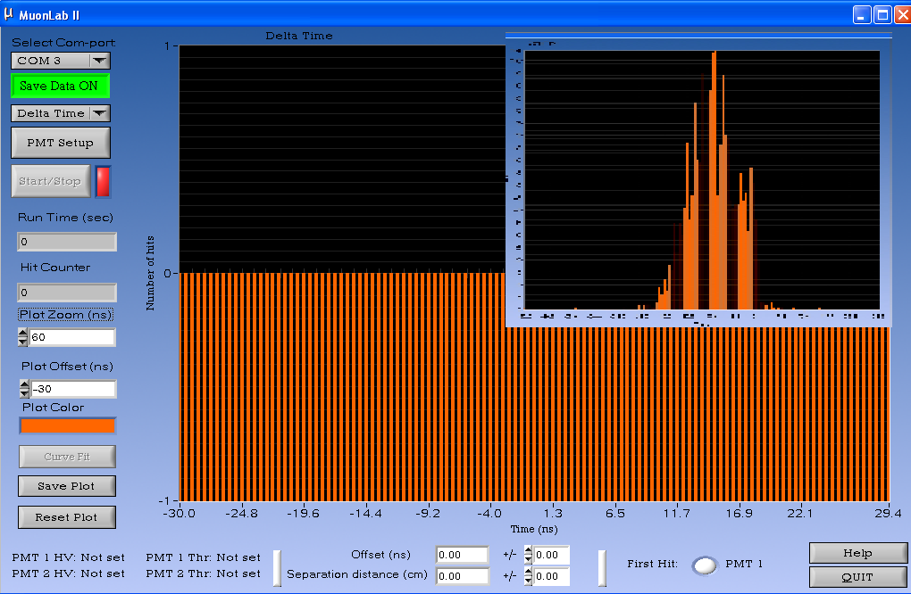
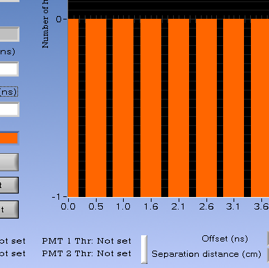

.. include:: subst.inc

Metingen aan muonen met twee detectoren
=======================================

Het histogram
-------------
In dit experiment voeren we een meting uit met twee muonbalken.  Kies voor een Delta Time instelling (derde knop).   Het scherm hieronder is het startscherm. De meting is dan nog niet begonnen. In de inzet kun je zien hoe na enkele minuten meten een histogram ontstaat. 

    
De x-as van het diagram geeft een tijdverschil weer in ns (nanoseconden !) Dit is de looptijd van het muon (De  tijd die het muon nodig heeft om van balk1 naar balk2 te reizen of omgekeerd). 

positieve en negatieve looptijden
^^^^^^^^^^^^^^^^^^^^^^^^^^^^^^^^^
Tijdens de meting komen zowel positieve als negatieve looptijden voor. Wanneer de balken boven op elkaar liggen geeft soms de bovenste balk als eerste een signaal, en soms de onderste muonbalk.Het is goed om hierbij stil te staan. 

.. note:: Muonen komen niet uit het aardoppervlak. Je zult een andere verklaring moeten zoeken wanneer de onderste muonbalk als eerste een signaal afgeeft. Onderzoek dit en overleg met collega studenten of met je begeleider wat hiervoor een verklaring kan zijn.

Op de y-as staat het aantal keren dat een looptijd geregistreerd wordt. In de figuur hierboven staan alle looptijden nog op 0.  Er is immers nog geen muon gemeten.

de bingrootte
^^^^^^^^^^^^^
Wanneer je een klein bereik kiest voor de x-as (inzoomen) kun je zien dat de breedte vand de categorieen 0,5 ns bedraagt! De looptijden kunnen dus met een grote nauwkeurigheid in kaart worden gebracht. Het is gebruikelijk de categorieen in een histogram "bins" te noemen. 

 
Metingen en opdrachten bij onderzoek 2
--------------------------------------
Voer bij deze opdracht kwantitatieve metingen uit  zodat je de een verband kunt onderzoeken tussen verschillende grootheden. 

* Varieer systematisch de afstand tussen de muonbalken variëren en kijkt dan wat er gebeurt.

.. note:: Wat is het verband tussen de hitrate (=aantal muonen/sec dat door beide balken gaat), en de afstand tussen de balken?

.. note:: Wat is het verband tussen de gemiddelde looptijd en de afstand tussen de muonbalken?

.. note:: Wat is het verband tussen de spreiding in looptijden en de afstand tussen de muonbalken?

Behalve de afstand, kun je ook de oriëntatie van de muonbalken varieren.
* Draai de muonbalken onder verschillende hoeken terwijl ze boven op elkaar liggen. Meet telkens gedurende enkele minuten.
* Draai de muonbalken onder verschillende hoeken terwijl ze enkele decimeters of meters boven elkaar gepositioneerd zijn. Meet telkens gedurende enkele minuten.
* Leg de muonbalken op verschillende afstanden in een horizontaal vlak en onderzoek of er nog steeds muonen door beide balken gaan.

.. note:: Uit welke richtingen komen muonen naar het aardoppervlak? Kun je dat uit je metingen afleiden? Voer desgewenst extra metingen uit.

Interpretatie van de metingen
-----------------------------
Wanneer je voldoende oriënterende metingen hebt verricht. Kun je antwoord geven op de volgende vragen.
* Waarom zijn negatieve looptijden mogelijk (de onderste muonbalk wordt eerder dan de bovenste muonbalk)? 

.. note:: Wanneer je nog geen antwoord hebt kunnen vinden op de bovenste vraag, sluit dan een verlengkabel aan op één der BMC-kabels en kijk wat er gebeurt met de gemiddelde waarde van de looptijd. Misschien brengt je dat op een idee wat betreft signaalvertragingen.

* Welke informatie geeft de gemiddelde looptijd van muonen je?
* Welke informatie geeft de spreiding in looptijden bij een meting?
* Wat is de snelheid van een muon in lucht ongeveer? Wat is de snelheid van het signaal door de kabels in de meetopstelling?
* Onder welke hoeken komen muonen naar het aardoppervlak? Kun je dat uit je metingen afleiden.

Vooruitblik
^^^^^^^^^^^
In het volgende deel van het onderzoek komt de volgende vraag aan bod:
* Hoe kun je met deze opstelling de levensduur ofwel de vervaltijd van muonen bepalen?
* Hoe kom je er achter dat je werkelijk muonen meet en geen signalen ten gevolge van andere deeltjes of ruis?

