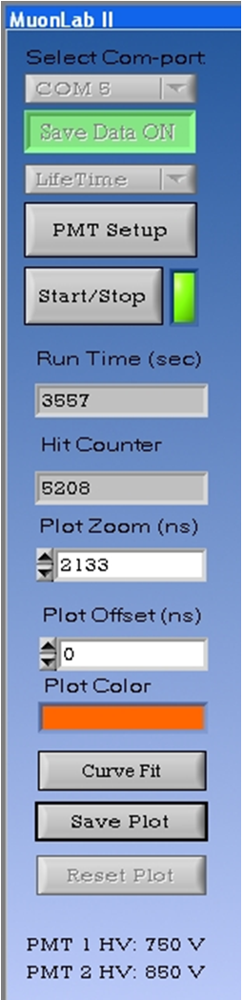
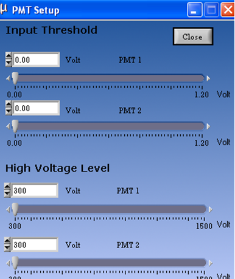

.. include:: subst.inc

Detecteren van kosmische straling
=================================

Werking van scintillator en PMT
-------------------------------
Kosmische straling wordt zichtbaar gemaakt in een “scintillator”. Kosmische deeltjes brengen atomen in het scintillatormateriaal in een aangeslagen toestand waarna deze atomen zichtbaar licht uitzenden. Het uitgezonden licht is zeer zwak en volstrekt verwaarloosbaar ten opzichte van daglicht of lamplicht zodat de scintillator zorgvuldig lichtdicht ingepakt is. 
Het zwakke licht dat ontstaat is sterk genoeg om een klein aantal elektronen vrij te maken uit een metaal. In een fotoversterker (PhotoMulTiplier of PMT in het Engels) wordt het kleine aantal elektronen vergroot tot ordegrootte honderdduizend waardoor een meetbare spanning ontstaat. Deze spanning is het signaal dat naar de computer gaat. Wanneer de opstelling goed werkt levert elk kosmische deeltje een spanningspuls. 
De PMT geeft ook wel toevallige signalen af die niets met kosmische straling te maken hebben. Je kunt er voor zorgen dat je kosmische straling meet en geen ruis door alleen gecorreleerde pulsen te tellen. Hoe dat in zijn werk gaat, blijkt gaandeweg het experiment. 

.. figure:: images/muonbalk.jpg
   :align: right
   :width: 400

.. note:: De detector bestaat uit: 
* Een scintillator (links)
* Een fotomultiplier (afgekort: PMT)
* Twee aansluitingen: Één voor het signaal en één voor de voeding van de PMT  (beide rechts).
    
Gebruik van muonlab en software
-------------------------------

Materiaal
^^^^^^^^^
* Twee muonbalken  met elk twee kabels: Een BMC-kabel  voor het signaal (zwart), en een kabel voor de spanning van de PMT (grijs).
* Muonlab II met een usb-kabel
* Computer waarop het meetprogramma *muonlab II* is geïnstalleeerd.

Meetmethode en gebruik van software
^^^^^^^^^^^^^^^^^^^^^^^^^^^^^^^^^^^
Controleer of usbkabel van het muonlab is aangesloten op de computer voordat je de software opstart.  Zet de computer aan en start het programma muonlab-II. Controleer ook of de twee kabels van de sensor (muonbalk) zijn aangesloten op één kanaal van het meetkastje (muonlab-II). 

   
Het menu van het programma muonlab-II

*Bovenste knop van het menu*: Het muonlab moet nog door de computer herkend worden. Dat kan door op te zoeken welke COM-poort de computer heeft toegekend aan de USB. -> Configuratiescherm -> Systeem -> Hardware -> Apparaatbeheer -> Poorten
Je ziet dan welke Com-poort is toegekend en selecteert deze bovenin het menu.

*Tweede knop.* Telkens wanneer je een meting start wordt de data weggeschreven naar file, wanneer je dit wilt. Je kunt dit uitzetten wanneer je bijvoorbeeld oriënterende metingen doet. 

*Met de derde knop* kies je het soort experiment dat je gaat uitvoeren: 
* Met twee detectoren (delta-time). 
* Met één detector (Life-time)
Voor het eerste onderzoek gebruik je de instelling: Delta-time.

*De vierde knop (PMT-setup)* dient om de fotomultiplier in te stellen, zodat je daadwerkelijk signaal binnenkrijgt. 
* Input Threshold. Stel deze in op 0,020 Volt Een kleinere signaalwaarde maakt dat je eerder ruis meet zijn dan een serieus signaal.
* High Voltage Level. Kies om te beginnen een waarde van 750 Volt voor de fotomultiplier. Deze werkt dan nog niet optimaal maar in elk geval redelijk.

.. note:: Je wilt ongetwijfeld weten: **waarom** de drempelwaarde juist 0,020 Volt bedraagt en **waar** het optimum van de hoogspanning ligt. Onderzoek dit in overleg met je begeleider **nadat je oriënterende metingen hebt gedaan.**

*Met de vijfde knop* start je de meting. 

Wanneer alles goed is ingesteld verschijnen nu in de tellers:
* Het aantal seconden dat gemeten wordt
* Het aantal detecties door beide muonbalken. 

Een signaal wordt alleen geteld wanneer **door beide detectoren, kort na elkaar,** een signaal wordt waargenomen.

Na enkele minuten heb je al heel wat kosmische deeltjes geteld als het goed is.  

   
.. note:: LET OP : Maak de spanning van de fotomultiplier nooit groter dan 1000V anders raakt dit kwetsbare onderdeel van de detector beschadigd.
   
.. note:: LET OP : Voor deze oriënterende metingen is het belangrijk dat beide detectoren op elkaar liggen zodat beide balken hetzelfde deeltje zien.

Oriënterende metingen en opdrachten
-----------------------------------
Voer oriënterende metingen uit door beide muonbalken in verschillende posities neer te leggen en het aantal detecties per seconde te noteren.
* Begin met beide detectoren op elkaar 
* Verschuif de detectoren vervolgens of leg ze op een grote afstand van elkaar.

.. note:: Waarom neemt het aantal detecties sterk af wanneer je de muonbalken van elkaar verwijdert?

.. note:: Hoe groot is het maximaal aantal deeltjes/sec dat je hebt waargenomen? Is de meting reproduceerbaar?

.. note:: Uit welke richting verwacht je dat de meeste kosmische straling komt? Kun je nu een uitspraak doen over  het aantal deeltjes per m2 per seconde dat vanuit de kosmos het aardoppervlak bereikt?

.. note:: Bekijk de muonbalk goed en maak een schatting voor de afmetingen van de scintillator. (Een van de muonbalken heeft een doorzichtige bovenkant zodat je goed kunt zien hoe de scintillator en de PMT er uitzien). 

.. note:: De afmetingen van de scintillator in de lange muonbalk zijn: 115cm x 9,0cm x 5,0cm. Bereken met deze gegevens het aantal kosmische deeltjes per m2 per seconde dat het aardoppervlak bereikt. Ga er voorlopig vanuit dat de kosmische straling loodrecht van boven komt.

Conclusies bij opdracht 1
^^^^^^^^^^^^^^^^^^^^^^^^^
Wanneer je voldoende oriënterende metingen hebt verricht. Kun je antwoord geven op de volgende vragen.
* Wat is de functie van de scintillator en op welke manier reageert deze op kosmische straling? Waarom is de scintillator zorgvuldig ingepakt? 
* Waar komt kosmische straling vandaan. Uit welke richtingen?
* Kan de kosmische straling makkelijk muren daken en bouwmateriaal gaan?
* Is het mogelijk dat de deeltjes die wij meten elektronen zijn? 
* Is het mogelijk dat de scintillator reageert op bijvoorbeeld gamma straling? en is het aannemelijk dat er veel gammastraling aanwezig is rond de detector? 

Voor het vervolgonderzoek gaan we er vanuit dat de detector voornamelijk muonen meet. Daarom is het belangrijk de bovenstaande vragen met je begeleider te bespreken.

Vooruitblik
^^^^^^^^^^^
In het volgende deel van het onderzoek komt de volgende vraag aan bod:
* Wat is er precies te zien in het diagram? Wat staat er op de x-as en wat betekenen de twee instellingen voor de meting *Delta-Time* en *Life-time*

